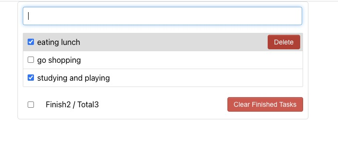

# ToDoList

## Description:

This is a small react project that can enable users to add todo list, click the list if the stuff has been finished, then delete the lists that have been
completed one by one using 'delete' button. Meanwhile, there is a 'status' button in the bottom part, which can show users how many lists have been completed.
Lastly, the 'clear finished tasks' button can remove all checked tasks immediately.
\
 
\

## Table of Contents

1. [Technical Features
   ](#tech)
   - [how to start?](#start)
2. [User Guidelines](#user)
3. [What did I learn?](#learn)
4. [Improvements](#improvement)

## Technical Features 

#### how to start? 

This project was created by 'Create React App' script.

To run the app in development mode, you can run from project directory:

npm start
Runs the app in the development mode.
Open http://localhost:3000 to view it in your browser.
The page will reload when you make changes.\

## User Guidelines 

- Firstly, users can add todo list
- Secondly, click the list if the stuff has been finished, then delete the lists that have been
  completed one by one using 'delete' button.
- Lastly, there is a 'status' button in the bottom part, which can show users how many lists have been completed; the 'clear finished tasks' button can remove all checked tasks immediately.

## What did I learn?

#### Delopyment

- I use this section to deploy live pages in Github: [https://facebook.github.io/create-react-app/docs/deployment](https://facebook.github.io/create-react-app/docs/deployment)

#### Code Splitting

- I learned how to split code into different folders to get best practice.
  This section has moved here: [https://facebook.github.io/create-react-app/docs/code-splitting](https://facebook.github.io/create-react-app/docs/code-splitting)

#### npm run build

- I use 'npm run build' to bundles React in production mode, which can optimize the build to get the best performance.
  Builds the app for production to the `build` folder.
  The build is minified and the filenames include the hashes.
  After build, the app is ready to be deployed!
  See the section about [deployment](https://facebook.github.io/create-react-app/docs/deployment) for more information.

#### create-react-app

- I learned how to use 'create-react-app' to build small projects, and how to install node-modules before start the project.
  In the process, I have not used Redux and Hooks, all of the states have been stored in their own components.
  I used class components and function components as well.

#### How to transfer state between parents and children

- I know how to transfer status between different components: If parent components want to transfer state values to its kids, it can use
  this.props in class components or props in function components, then kids can accept and use those state values.
  If kids want to transfer state or other values to its parent, it can call the function which passed from its parent, then pass children's status or
  other input values as parameters into this function so its parent can accept the state value from its kids.

## Improvements 

- will add some **react-icons** and use some UI libraries such as Ant Design or Material UI to render the style.
- will import **google-fonts** to create different word format.
- will use **hooks** or **redux** to improve this small project.
- will write test code for this project.

- `npm test`

Launches the test runner in the interactive watch mode.
See the section about [running tests](https://facebook.github.io/create-react-app/docs/running-tests) for more information.

- `Learn More`
  You can learn more in the [Create React App documentation](https://facebook.github.io/create-react-app/docs/getting-started).
